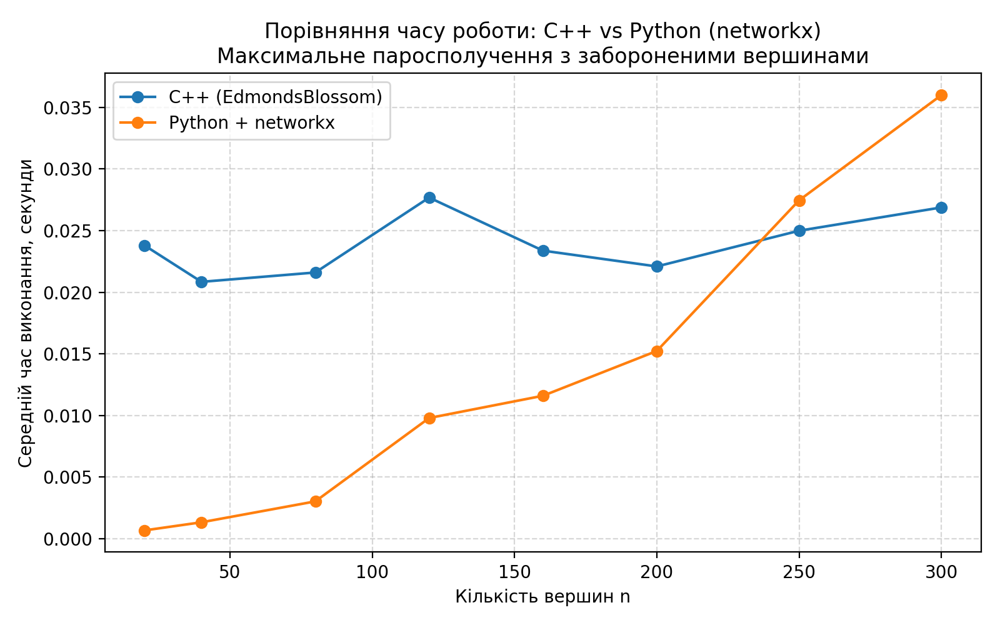
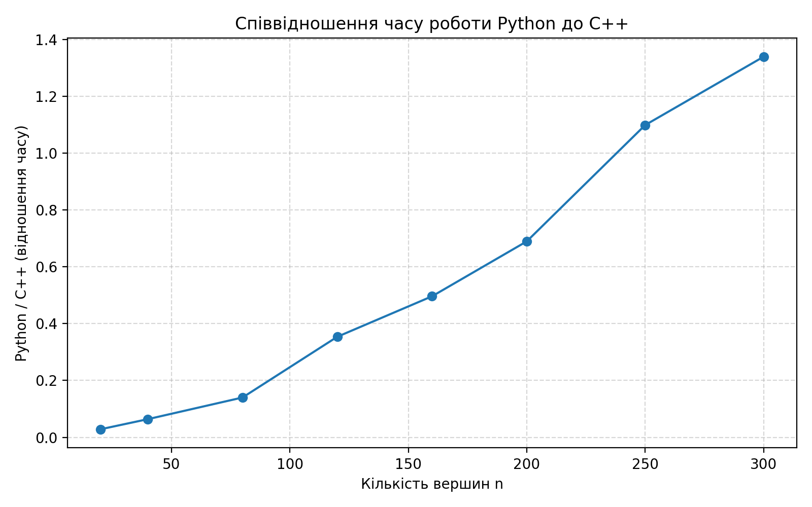

# Maximum Matching with Forbidden Vertices

This project implements the **maximum matching problem** in an undirected graph with **forbidden vertices**.

The algorithm is implemented in **C++ using Edmonds' Blossom Algorithm**, and the results are compared with a **Python implementation using NetworkX**.

The repository also contains a **benchmark script** that compares the runtime of both implementations.

---

# Problem Statement

Given an undirected graph

$$
G = (V, E)
$$

and a subset of forbidden vertices

$$
B \subseteq V
$$

the task is to find a **maximum matching** such that:

- no two edges share a common vertex
- no edge is incident to any vertex from $B$

Formally:

$$
\forall (u,v) \in M: \quad u \notin B, \; v \notin B
$$

where $M$ is the matching.

---

# Algorithms Used

## Edmonds' Blossom Algorithm

The C++ implementation uses **Edmonds' Blossom Algorithm**, which finds a maximum matching in a general undirected graph.

Key idea:

- build **alternating trees**
- search for **augmenting paths**
- detect **odd cycles (blossoms)**
- contract them and continue the search

Time complexity:

$$
O(V^3)
$$

where:

- $V$ — number of vertices.

The implementation maintains structures such as:

- `match[v]` — partner of vertex $v$
- `parent[v]` — parent in BFS tree
- `base[v]` — base vertex of blossom
- `used[v]` — visited flag
- `blossom[v]` — blossom marker :contentReference[oaicite:1]{index=1}.

---

# Handling Forbidden Vertices

Forbidden vertices are processed **during graph construction**.

If an edge is incident to a forbidden vertex, it is **not added to the graph**:

```
if (forbidden[u] || forbidden[v]) {
continue;
}
```


Thus the algorithm runs on a filtered graph

$$
G' = (V, E')
$$

where

$$
E' = \{(u,v) \in E \mid u,v \notin B\}
$$

This keeps the Blossom algorithm unchanged.

---


### Files

| File | Description |
|-----|-------------|
| `max_matching_forbidden.cpp` | C++ implementation of Edmonds Blossom algorithm |
| `max_matching_forbidden.py` | Python implementation using NetworkX |
| `benchmark_matching.py` | Benchmark comparing C++ and Python implementations |
| `test*.csv` | Example graph inputs |

The Python implementation uses:
```
networkx.max_weight_matching(maxcardinality=True)
```


to compute maximum matching :contentReference[oaicite:2]{index=2}.

---

# Input Format

Input graphs are provided as **CSV files**.

Example:

```
n,k,m
5,1,5
forbidden_vertices
3
u,v
1,2
1,3
2,3
2,4
4,5
```


Where:

- $n$ — number of vertices
- $k$ — number of forbidden vertices
- $m$ — number of edges

---

# Output Format
```
2
1 2
4 5
```

First line:

```
|M|
```


size of the matching.

Next lines:
```
u v
```


edges of the matching.

---

# Running the C++ Implementation

Compile:
```
g++ -std=c++17 -O2 max_matching_forbidden.cpp -o max_matching_forbidden.exe
```

Run:
```
./max_matching_forbidden.exe test1.csv
```


---

# Running the Python Implementation
```
python max_matching_forbidden.py test1.csv
```


---

# Benchmark

Benchmarking compares:

- **C++ Blossom implementation**
- **Python NetworkX implementation**

Random graphs are generated and tested.

Example parameters:

- $n = 20 \dots 300$
- random edges
- fixed ratio of forbidden vertices

The benchmark script measures runtime using `time.perf_counter()` :contentReference[oaicite:3]{index=3}.

---

# Benchmark Results

## Execution Time



Observations:

- for small graphs Python is faster
- around

$$
n \approx 250
$$

C++ becomes faster.

---

## Runtime Ratio



The ratio

$$
\frac{T_{Python}}{T_{C++}}
$$

shows that:

- for small graphs Python appears faster
- for large graphs Python becomes slower
- at $n = 300$ Python is about

$$
1.3\times
$$

slower.

---

# Why Python is Faster for Small Graphs

The C++ implementation is executed through
```
subprocess.run("./max_matching_forbidden.exe")
```


in the benchmark script.

Thus each run includes:

- process creation
- loading executable
- runtime initialization

For small graphs this overhead dominates the runtime.

---

# Correctness Verification

For all tested graphs:

- both implementations produced matchings of **equal size**
- no counterexample was found.

Different matchings may appear because **maximum matching is not always unique**.

---

# Conclusion

The C++ implementation of Edmonds Blossom algorithm is:

- correct
- scalable
- faster for larger graphs

Compared to the Python implementation using NetworkX.


